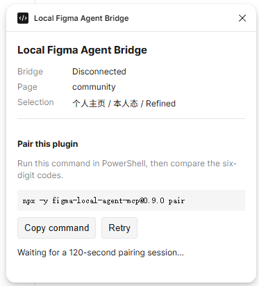
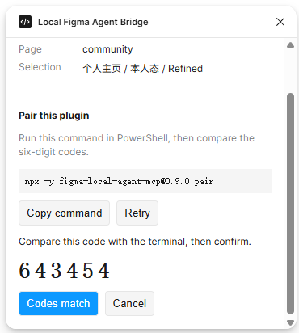
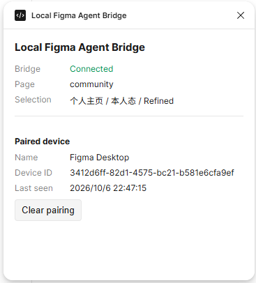

# Local Figma Agent MCP

Let local coding agents read Figma Design documents safely and create reviewable changes in isolated Proposal copies.

[中文](README.md) · [English documentation](docs/en-US/README.md) · [Latest release](https://github.com/Lancasteerr/figma_bridge_agent/releases/latest) · [Report an issue](https://github.com/Lancasteerr/figma_bridge_agent/issues)

> Local-first · No direct source edits · No cloud relay · No telemetry

This unofficial developer tool is distributed through GitHub. It is not affiliated with or endorsed by Figma and is not published to Figma Community. Figma data and bridge credentials stay on the local loopback interface.

## What it does

| Capability             | Description                                                                              |
| ---------------------- | ---------------------------------------------------------------------------------------- |
| Local reads            | Read the current file, selection, node tree, styles, variables, fonts, and Inspect CSS   |
| Visual inspection      | Render nodes and export PNG or SVG files to an automatically cleaned temporary directory |
| Safe edits             | Clone targets and required layout context, then edit only inside an isolated Proposal    |
| Declarative generation | Validate a complete DesignPlan before atomically creating a new Proposal                 |
| Multi-client reuse     | Share one managed Bridge Daemon across multiple local MCP Adapters                       |

The MCP Server currently exposes 23 bounded tools. See the [MCP tool reference](docs/en-US/tools.md) for the complete list and recommended call sequences.

## Interface preview

### First-time pairing

Before pairing, the plugin shows the PowerShell command. Once pairing begins, the terminal and plugin display a six-digit code for manual comparison.

<p align="center">
  
  
</p>

### Connected state

After pairing, the plugin window shows the Bridge connection, current document, and most recent connection time.

<p align="center">
  
</p>

Agent changes appear as an isolated Proposal on the Figma canvas, ready to review beside the source design.

## Quick start

### Requirements

- Windows
- Node.js 20 or newer
- Figma Desktop
- A coding agent with local stdio MCP or Agent Plugins 1.0 support

Regular users do not need Git, pnpm, or a source checkout. The Figma plugin ZIP, MCP npm package, and Agent Plugin must come from the same version. The examples below use the current stable version, `0.9.0`.

### 1. Install the Agent Plugin

Clients with Agent Plugins 1.0 support should prefer the portable Agent Plugin. All three platforms use the same plugin directory through platform-specific marketplace entry points.

First add the version-pinned marketplace to Codex:

```powershell
codex plugin marketplace add Lancasteerr/figma_bridge_agent --ref v0.9.0
```

Then run `/plugins` and install **Local Figma Agent** from the `figma-local-agent` marketplace. For GitHub Copilot CLI:

```powershell
copilot plugin marketplace add Lancasteerr/figma_bridge_agent#v0.9.0
copilot plugin install figma-local-agent@figma-local-agent
```

Cursor team administrators can import `https://github.com/Lancasteerr/figma_bridge_agent` from **Dashboard → Plugins & MCPs → Add Marketplace → Import from Repo**. Developers then install it from **Customize**. See [installation and configuration](docs/en-US/configuration.md) for complete platform steps, the direct Copilot fallback, and Cursor local development. If the client does not support Agent Plugins, see [Windows MCP host configuration](docs/en-US/hosts.md).

### 2. Import the Figma plugin

Download `figma-agent-bridge-plugin-v0.9.0.zip` from the matching [v0.9.0 GitHub Release](https://github.com/Lancasteerr/figma_bridge_agent/releases/tag/v0.9.0) and extract it to a stable directory.

In **Figma Desktop → Plugins → Development → Import plugin from manifest**, select:

```text
figma-agent-bridge-plugin/manifest.json
```

### 3. Complete first-time pairing

Start **Local Figma Agent Bridge** in Figma and keep its window open. Then run this command in PowerShell:

```powershell
npx -y figma-local-agent-mcp@0.9.0 pair
```

Click **Codes match** only when the six-digit codes in the terminal and plugin are identical. After a successful pairing, the plugin authenticates and reconnects automatically on later starts.

### 4. Verify the connection

Restart the MCP client or open a new agent session, then ask the agent to call `figma_status`. A healthy result includes protocol v4, the current Figma file, page, selection, and Bridge capabilities.

For Development builds, source builds, and complete troubleshooting, see [installation and configuration](docs/en-US/configuration.md).

## Basic usage

1. Open the target Design file and **Local Figma Agent Bridge** in Figma Desktop.
2. Check `figma_status` first in the agent.
3. Select the relevant nodes in Figma and describe the read, edit, or generation task.
4. Review the resulting Proposal on the canvas. Public write tools never overwrite the source artwork.

Example requests:

- “Read the current selection and explain its hierarchy, Auto Layout, fonts, and visual styles without changing Figma.”
- “Duplicate the selected card as a Proposal, adjust its spacing and title, then render the result for review.”
- “Use DesignPlan to create a new login-card Proposal. Validate the complete plan first, then apply it and render a preview.”

## How it works

```text
Coding Agent
  ↕ independent stdio session
MCP Adapter
  ↕ authenticated ws://127.0.0.1:3900/mcp
Local Bridge Daemon
  ↕ per-device authenticated ws://127.0.0.1:3900/
Figma plugin UI and main process
  ↕ Figma Plugin API
Current page of the current Design file
```

During first-time pairing, the user compares a six-digit code. Later connections authenticate each plugin device with an independent credential and fresh proofs. The Bridge listens only on `127.0.0.1`; it has no remote or cloud transport.

When editing an existing design, the Bridge clones the targets and required layout context into a Page-level Proposal. Consecutive writes use complete-tree fingerprints to protect concurrent edits. To generate a complex design from scratch, an agent can validate a DesignPlan and then use the single-use, five-minute validation ID to create the Proposal atomically.

See the [architecture and safety model](docs/en-US/architecture.md) for implementation details.

## Security boundaries

- Public write tools can only create a Proposal or edit nodes inside a Bridge-marked Proposal root.
- Input assets accept Base64 only. The Server does not fetch URLs or read caller-provided local files.
- Team Library is never queried. Place an external Instance on the current page before reusing it.
- Exports go only to a temporary directory, include a SHA-256 digest, and are cleaned up after the session.
- Only one Figma plugin window can be active at a time. Remote-only agents cannot reach the local Bridge.

See [security notes](docs/en-US/security.md) for complete boundaries and operational guidance.

## Documentation

| Document                                                      | Audience                   | Contents                                                    |
| ------------------------------------------------------------- | -------------------------- | ----------------------------------------------------------- |
| [Documentation home](docs/en-US/README.md)                    | Everyone                   | Choose documentation by task                                |
| [Installation and configuration](docs/en-US/configuration.md) | Users                      | Stable, Development, and source builds plus troubleshooting |
| [MCP tool reference](docs/en-US/tools.md)                     | Users and agent developers | 23 tools, write boundaries, and call sequences              |
| [Architecture and safety model](docs/en-US/architecture.md)   | Developers                 | Processes, protocol, Proposal, and DesignPlan lifecycles    |
| [Development guide](docs/en-US/development.md)                | Contributors               | Monorepo, commands, tests, and builds                       |
| [End-to-end acceptance](docs/en-US/acceptance.md)             | Contributors               | Distribution and Figma scenario validation                  |

## Local development

Contributors need Node.js 20+ and pnpm 11.19.0:

```powershell
pnpm install --frozen-lockfile
pnpm check
pnpm build:release
```

`pnpm check` validates the Agent Plugin, type-checks, lints, checks formatting, runs tests, and builds. `pnpm build:release` creates the Figma plugin ZIP, npm tarball, portable Agent Plugin ZIP, and `SHA256SUMS` under `artifacts/`.

See the [development guide](docs/en-US/development.md) for the environment and repository structure.

## Current scope

v0.9.0 supports Windows, local stdio, multiple MCP Adapters, one active Figma plugin, and the current page of the current Design file. It supports reads, renders, exports, controlled Proposal edits, and validated DesignPlans.

The current release does not provide a Windows installer, automatic updates, remote transport, cloud sync, arbitrary JavaScript, direct source-artwork writes, general deletion, Instance detaching, Team Library queries, or framework code generation.

## License

This project is available under the [MIT License](LICENSE). Review generated Proposals and exported content in your own environment before use.
